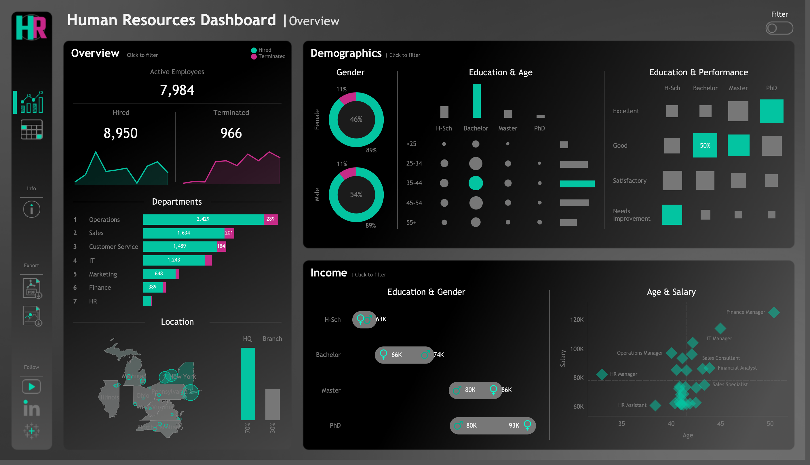

# HR Dashboard Project

Welcome to the **HR Dashboard Project** repository! 🚀  
This project showcases the end-to-end process of generating, transforming, and analyzing HR data through a fully functional dashboard. Designed as a **portfolio-ready data analytics project**, it combines **data engineering**, **data analysis**, and **visual storytelling** for HR insights.

---
## 📖 Project Overview

This project involves:

1. **Synthetic Data Generation** — Creating a realistic HR dataset of **8,950 employees** using Python and Faker.
    
2. **Data Transformation & Cleansing** — Validating and standardizing employee details (dates, salaries, demographics).
    
3. **Dashboard Development** — Building a Power BI or Tableau dashboard to visualize key HR insights.


🎯 **Core Focus Areas:**

- Python Data Generation
    
- Data Cleansing and Transformation
    
- Data Modeling for Analytics
    
- HR Metrics Visualisation

---

## 🚀 Project Requirements

#### Objective
To provide HR managers with a comprehensive analytical dashboard for workforce insights — combining **summary-level metrics** and **individual employee records**.

## 📊 Dashboard Design



### **Summary View**

Divided into three main analytical sections:

#### 🧾 Overview

- Total number of hired, active, and terminated employees
    
- Trends of hires vs terminations over the years
    
- Department- and job title-wise employee count
    
- Comparison of HQ (New York) vs branch offices
    
- Distribution of employees across cities and states
    

#### 👥 Demographics

- Gender ratio visualization
    
- Age and education level distributions
    
- Employee count by age group and education level
    
- Correlation between education level and performance ratings
    

#### 💰 Income Analysis

- Salary comparisons across education levels and genders
    
- Correlation between age and salary within departments

---

## 📂 Repository Structure
```
HR-Dashboard-project/
│
├── dataset/                            # Raw datasets used for the project
│
├── mockups.drawio/                     # Draw.io file for dashboard layout
│
├── generate_data.ipynb/                # Python script to generate dataset
│
├── README.md                           # Project overview and instructions
│
├── LICENSE                             # License information for the repository
```


---

## 🛡️ License

This project is licensed under the [MIT License](LICENSE). You are free to use, modify, and share this project with proper attribution.

## 🌟 About Me

Hi there! I'm **Ankit Khareshiya**. I’m a student who likes working with data.

Feel free to connect with me on the following platforms:

[](https://www.linkedin.com/in/ankit-khareshiya/) 
